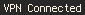
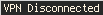

# polybar-mullvad-status

A script that shows if Mullvad is connected, connecting or disconnected.

Notifications are builtin, unlike the version I submitted to [polybar-scripts](https://github.com/polybar/polybar-scripts).

The script checks for the `POLYBAR_MULLVAD_STATUS` variable at runtime, which
should be the location you want to write the statusfile to. The default is
`/tmp/mullvad_status.last`.




## Module

```ini
[module/polybar-mullvad-status]
type = custom/script
exec = $PATH_TO_SCRIPT
interval = 5
```
